# BMC Helix ITOM & ITSM OnPrem Installation Step by Step 3 - ITSM

- [BMC HelixOM ITOM & ITSM OnPrem Installation Step by Step 3 - ITSM](#bmc-helixom-itom-&-itsm-onprem-installation-step-by-step-3---itsm)
  - [1 Download installation file](#1-download-installation-file)
  - [2 Sync Helix ITSM images to local Harbor](#2-sync-helix-itsm-images-to-local-harbor)
  - [3 Setup PostgreSQL database](#3-setup-postgresql-database)
  - [4 Setup Helix Deployment Engine](#4-setup-helix-deployment-engine)
  - [5 Setup Installation environment](#5-setup-installation-environment)
  - [6 Install Helix Platform Common services](#6-install-helix-platform-common-services)
  - [7 Config HELIX_ONPREM_DEPLOYMENT pipeline](#7-config-helix_onprem_deployment-pipeline)
  - [8 Install Helix Service Management](#8-install-helix-service-management)


**Attention**! The installation of Helix Innovation Suite(ITSM) depends on Helix Platform Common services. Please refer to [BMC-Helix-OnPrem-Installation-2-ITOM](https://github.com/rivertb/BMC-Helix-OnPrem-Installation-2-ITOM?tab=readme-ov-file) and complete at least the section of "2 Deploy Helix Dashboard".

## 1 Download installation file
You obtain the BMC Helix Service Management installation files by downloading them from the BMC Electronic Product Distribution (EPD) website.

* Git repositories and artifacts that are used for BMC Helix Service Management installation
* Deployment manager that is used for BMC Helix Platform Common Services installation (Already download in [ITOM](https://github.com/rivertb/BMC-Helix-OnPrem-Installation-2-ITOM) project)

In the BMC Helix Innovation Suite OnPrem page, on the Product tab, select BMC Helix Innovation Suite & Service Management Apps latest version, such as  BMC Helix Innovation Suite & Service Management Apps latest version, such as 26.1.01 , and click Download.
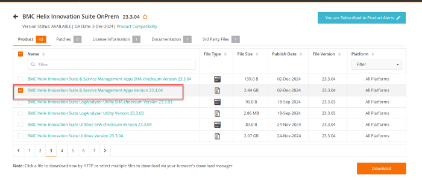

The BMC_Helix_Innovation_Suite_And_Service_Management_Apps_Version_26.1.01.zip file contains the following files:

* helix-sm-deployment-engine-2026101.1.00.00.zip —This file contains BMC Deployment Engine set up files.
* BMC_Remedy_Deployment_Manager_Configuration_Release_2026101.1.00.00.zip —This file contains the installation artifacts.
* image_pull_push.sh and image_sync_to_private_registry.sh —These files contain the scripts to synchronize your Harbor repository with BMC Helix Innovation Suite and BMC Helix Platform services container images in BMC DTR.

## 2 Sync Helix ITSM images to local Harbor

The latest list of images required for BMC Helix Service Management installation can be download from [here](https://docs.bmc.com/xwiki/bin/view/Service-Management/On-Premises-Deployment/BMC-Helix-Service-Management-Deployment/brid26101/Installing/Preparing-for-installation/Setting-up-a-Harbor-repository-to-synchronize-container-images/), including:

 * 26101_ITSM_Platform_Images.txt
 * 26101_ITSM_SmartApps_Images.txt
 * 26101_ITSM_Pipeline_Images.txt 
 * 26101_SupportAssistTool_Images.txt
 * 26101_ITSM_Deployment_Engine_Images.txt
 * 261_Helix_Platform_Core_Images.txt 
 * 261_Helix_Platform_Full_Images.txt
 * 254_Helix_Platform_Images.txt​​​​​​ 
 * 21304_Smart_Reporting_images.txt

You can also copy from ~/BMC-Helix-OnPrem-Installation-1-Env/helix-itsm-images-files-25.4.01.
```
cp -R ~/BMC-Helix-OnPrem-Installation-1-Env/helix-itsm-26.1.01 /root/.
cd /root/helix-itsm-26.1.01
chmod a+x *.sh
dnf install dos2unix -y
dos2unix *.txt
ls -l

-rw-r--r-- 1 root root  206 Mar  9 09:44 21304_Smart_Reporting_images.txt
-rw-r--r-- 1 root root  311 Mar  9 09:44 26101_ITSM_Deployment_Engine_Images.txt
-rw-r--r-- 1 root root 4640 Mar  9 09:44 26101_ITSM_Pipeline_Images.txt
-rw-r--r-- 1 root root 3131 Mar  9 09:44 26101_ITSM_Platform_Images.txt
-rw-r--r-- 1 root root 1665 Mar  9 09:44 26101_ITSM_SmartApps_Images.txt
-rw-r--r-- 1 root root  119 Mar  9 09:44 26101_SupportAssistTool_Images.txt
-rw-r--r-- 1 root root 1003 Mar  9 09:44 261_Helix_Platform_Core_Images.txt
-rw-r--r-- 1 root root 4865 Mar  9 09:44 261_Helix_Platform_Full_Images.txt
-rwxr-xr-x 1 root root  536 Mar 13 16:33 download_all.sh
-rwxr-xr-x 1 root root 1090 Mar  9 09:43 helix_file_to_tar_gz.sh
-rwxr-xr-x 1 root root 1609 Mar  9 09:43 helix_load_and_push.sh
-rwxr-xr-x 1 root root  826 Mar 13 16:35 push_all.sh
```
Synchronize the Helix ITSM images from https://docker.io to local Harbor server.
```
nohup ./download_all.sh > nohup.out &
tail -f nohup.out

# Due to the limitation of network speed, the entire download process may take several hours to several days.

# Upload images to Harbor
nohup ./pull_all.sh > nohup.out &
tail -f nohup.out
```
The image synchronization process may take several hours to one day.

## 3 Setup PostgreSQL database

BMC Helix Service Management supports both case-insensitive and sensitive PostgreSQL13.x and 17.x databases. You must set up your PostgreSQL database before you deploy the BMC Helix Innovation Suite platform and applications. For detailed instructions on installing the postgresql database, please refer to:[Install PostgreSQL on Linux](https://www.postgresql.org/download/linux/redhat/)
```
sudo dnf install -y https://download.postgresql.org/pub/repos/yum/reporpms/EL-10-x86_64/pgdg-redhat-repo-latest.noarch.rpm
sudo dnf -qy module disable postgresql
sudo dnf install -y postgresql17-server
sudo /usr/pgsql-17/bin/postgresql-17-setup initdb
sudo systemctl enable postgresql-17
sudo systemctl start postgresql-17
```
Install postgres-contrib by using the following command:
```
yum install postgres*contrib -y
```
Update the pg_hba.conf file and postgresql.conf file:
```
sudo su postgres <<'EOF'
psql -c "ALTER USER postgres with encrypted password 'bmcAdm1n'"
echo "[INFO]: editing pg_hba.conf"
sed -i '/^local   all/c\local   all             all                                     scram-sha-256' /var/lib/pgsql/17/data/pg_hba.conf
sed -i '/^host    all             all             127.0.0.1/c\host    all             all             0.0.0.0\/0            scram-sha-256' /var/lib/pgsql/17/data/pg_hba.conf
echo "[INFO]: editing postgresql.conf"
sed -i "/^#listen_addresses = 'localhost'/c \listen_addresses = '*'" /var/lib/pgsql/17/data/postgresql.conf
sed -i '/^#password_encryption = scram-sha-256/c \password_encryption = scram-sha-256' /var/lib/pgsql/17/data/postgresql.conf
sed -i '/^max_connections = 100/c \max_connections = 600' /var/lib/pgsql/17/data/postgresql.conf
sed -i '/^#random_page_cost = 4.0/c \random_page_cost = 1.1' /var/lib/pgsql/17/data/postgresql.conf
EOF
```
Restart PostgreSQL database 
```
systemctl restart postgresql-17
```
Add firewall rule for postgresql database
```
firewall-cmd --zone=internal --permanent --add-service=postgresql
firewall-cmd --zone=external --permanent --add-service=postgresql
firewall-cmd --reload
```
Check the database server parameter value for max_connections
```
sudo su postgres <<'EOF'
export PGPASSWORD=bmcAdm1n
psql -U postgres -c "show max_connections;"
EOF
```
## 4 Setup Helix Deployment Engine

### 4.1 Config deployment-engine-config.env
```
su - git
cd helix-sm-deployment-engine
vi deployment-engine-config.env
```
| Parameter | Value | Desc |
| --- | --- | --- |
| NAMESPACE | helixde| BMC Helix Deployment Engine namespace |
| STORAGE_CLASS_NAME | nfs-storage | Storage class name |
| IMAGE_REGISTRY | helix-harbor.bmc.local  | Local registry name |
| REGISTRY_ORG | bmchelix | Local registry org  |
| IMAGE_REGISTRY_USER | admin  | User name to log in to your local container registry.  |
| IMAGE_REGISTRY_PASSWORD | bmcAdm1n | Password to log in to your local container registry.  |
| IMAGE_PULL_SECRET | registry-secret  | Kubernetes image registry secret name  |
| JENKINS_PASS | bmcAdm1n  | Jenkins administrator password |
| GITEA_ADMIN_PASS | bmcAdm1n | Gitea password. |
| KUBECONFIG_FILE | /root/.kube/config | Full path to the **.kube/config** file. |
| SMART_REPORTING | false  | Install Smart Reporting? |
| OPENSHIFT_ENABLED | false  | OpenShift clusters? |
| CREATE_SERVICE_ACCOUNTS | true | ServiceAccount creation? |
| INGRESS_CLASS | nginx | Ingress class name of the NGINX Ingress Controller. |
| JENKINS_INGRESS_ENABLED | true  | Using Jenkins Ingress controller? |
| JENKINS_HOSTNAME | helix-svc.bmc.local | Jenkins host name. |
| GITEA_INGRESS_ENABLED | true | Using Gitea Ingress controller？ |
| GITEA_HOSTNAME | helix-k8s-worker04.bmc.local | Gitea host name. |
| JENKINS_USER | admin | Jenkins admin user. |
| GITEA_ADMIN_USER | ciadmin | Gitea admin user. |
| JENKINS_URL | http://jenkins-master:8080 | Jenkins In-cluster URLs. |
| GITEA_URL | http://gitea:3000 | Gitea In-cluster URLs. |
| JENKINS_PROTOCOL | https | Jenkins protocol. |
| GITEA_PROTOCOL | https | Gitea protocol. |

### 4.2 Install Deployment Engine in k8s cluster

To run the deployment script, run the following command:

```
su - root
./deployment-engine.sh
```

### 4.3 Login Jenkins Console

JENKINS_HOSTNAME in deployment-engine-config.env

https://helix-svc.bmc.local

## 5 Setup Installation environment
### 5.1 Verifying DNS for applications
We have configured DNS for the BMC Helix Service Management applications so that we can access the applications by using the following URL format. 
* Mid Tier: \<CUSTOMER_SERVICE\>-\<ENVIRONMENT\>.<CLUSTER_DOMAIN>
* Mid Tier integration: \<CUSTOMER_SERVICE\>-\<ENVIRONMENT\>-int.<CLUSTER_DOMAIN>
* Smart IT: \<CUSTOMER_SERVICE\>-\<ENVIRONMENT\>-smartit.<CLUSTER_DOMAIN>
* Smart Reporting: \<CUSTOMER_SERVICE\>-\<ENVIRONMENT\>-sr.<CLUSTER_DOMAIN>
* Innovation Studio: \<CUSTOMER_SERVICE\>-\<ENVIRONMENT\>-is.<CLUSTER_DOMAIN>
* Innovation Suite REST API or CMDB: \<CUSTOMER_SERVICE\>-\<ENVIRONMENT\>-restapi.<CLUSTER_DOMAIN>
* Atrium Web Services: \<CUSTOMER_SERVICE\>-\<ENVIRONMENT\>-atws.<CLUSTER_DOMAIN>
* Digital Workplace: \<CUSTOMER_SERVICE\>-\<ENVIRONMENT\>-dwp.<CLUSTER_DOMAIN>
* Digital Workplace Catalog: \<CUSTOMER_SERVICE\>-\<ENVIRONMENT\>-dwpcatalog.<CLUSTER_DOMAIN>
* Live Chat: \<CUSTOMER_SERVICE\>-\<ENVIRONMENT\>-vchat.<CLUSTER_DOMAIN>
* Openfire Chat: \<CUSTOMER_SERVICE\>-\<ENVIRONMENT\>-chat.<CLUSTER_DOMAIN>
* Support Assistant tool: \<CUSTOMER_SERVICE\>-\<ENVIRONMENT\>-supportassisttool.<CLUSTER_DOMAIN>

```
ping -c 4 itsm-poc.bmc.local
ping -c 4 itsm-poc-int.bmc.local
ping -c 4 itsm-poc-smartit.bmc.local
ping -c 4 itsm-poc-sr.bmc.local
ping -c 4 itsm-poc-is.bmc.local
ping -c 4 itsm-poc-restapi.bmc.local 
ping -c 4 itsm-poc-atws.bmc.local
ping -c 4 itsm-poc-dwp.bmc.local
ping -c 4 itsm-poc-dwpcatalog.bmc.local
ping -c 4 itsm-poc-vchat.bmc.local
ping -c 4 itsm-poc-chat.bmc.local
ping -c 4 itsm-poc-supportassisttool.bmc.local
```

### 5.2 Configure Helix Single Sign-On

Log in to BMC Helix Single Sign-On

* URL: lb.bmc.local/rsso
* Username: Admin
* Password: RSSO#Admin#

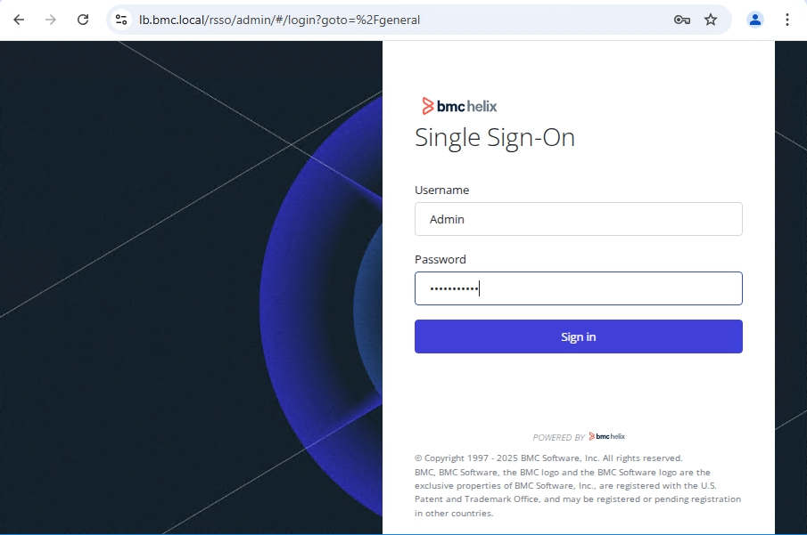

Click Tenant menu, select the SAAS_TENANT, click "Select Tenant" under Action column, the "Tenant SAAS_TENANT is selected" confirmation message is displayed on the screen.
Copy another tenant name of adelab.\<TENANT-ID\> for later use.

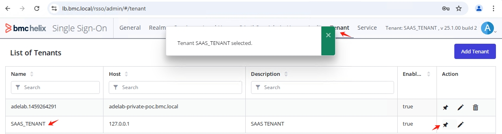

On the main menu, click Realm.
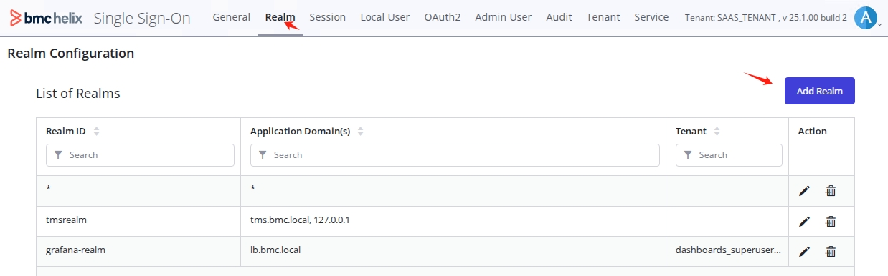

In the General tab, enter the following details:

| Filed | Value | Desc |
| --- | --- | --- |
| Realm ID | itsm-poc | \<CUSTOMER_SERVICE\>-\<ENVIRONMENT\> |
| Application Domain(s) | itsm-poc-atws.bmc.local, itsm-poc-dwpcatalog.bmc.local, itsm-poc.bmc.local, itsm-poc-restapi.bmc.local, itsm-poc-is.bmc.local, itsm-poc-sr.bmc.local, itsm-poc-dwp.bmc.local, itsm-poc-smartit.bmc.local, itsm-poc-chat.bmc.local, itsm-poc-vchat.bmc.local, itsm-poc-int.bmc.local |  |
| Tenant | adelab.\<TENANT-ID\> | paste the tenant name |

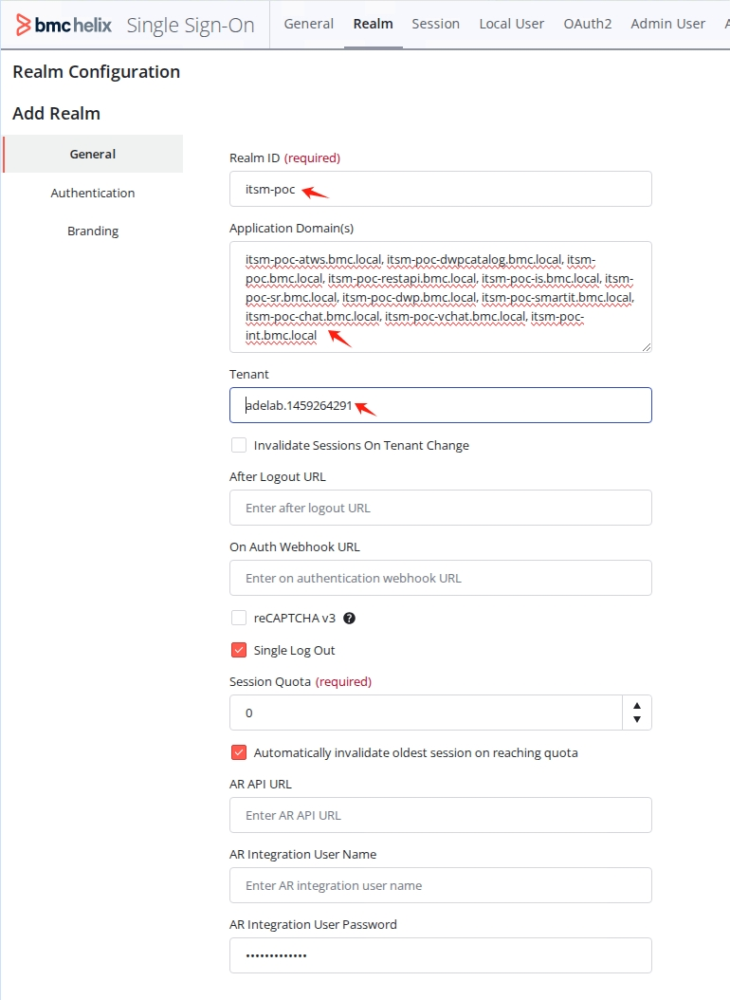

Click Authentication on the left tab, and enter the following details:

* Authentication Type: AR Server
* Host: platform-user-ext.helixis, helixis is the Helix Innovation Suite namespace
* Port: 46262 fix value

| Field | Value | Desc |
| --- | --- | --- |
| Authentication Type | AR Server |  |
| Host | platform-user-ext.helixis | helixis is the namespace of Helix Innovation Suite |
| Port | 46262 | Port Number – 46262 |

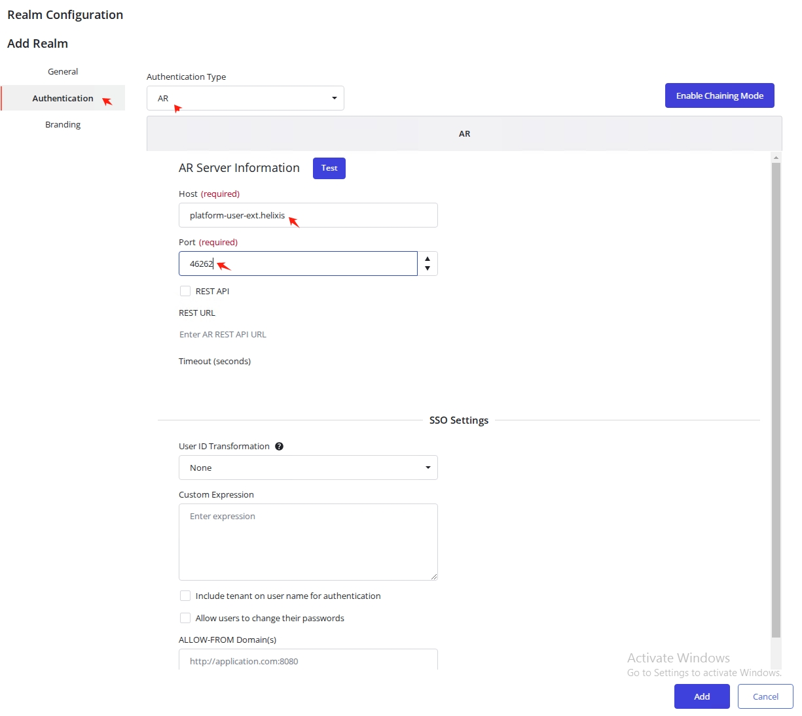

## 6 Install Helix Platform Common services

Change value setting in /root/helix-on-prem-deployment-manager-26.1.00-63/configs/deployment.config

| Line No. | Parameter | Value |
| --- | --- | --- |
| 79 | SM_PLATFORM_FULL | yes |

Execute Deployment Manager script
```
/root/helix-on-prem-deployment-manager-26.1.00-63/deployment-manager.sh
```

## 7 Config HELIX_ONPREM_DEPLOYMENT pipeline
On Jenkins Dashboard, click the HELIX_ONPREM_DEPLOYMENT pipeline.
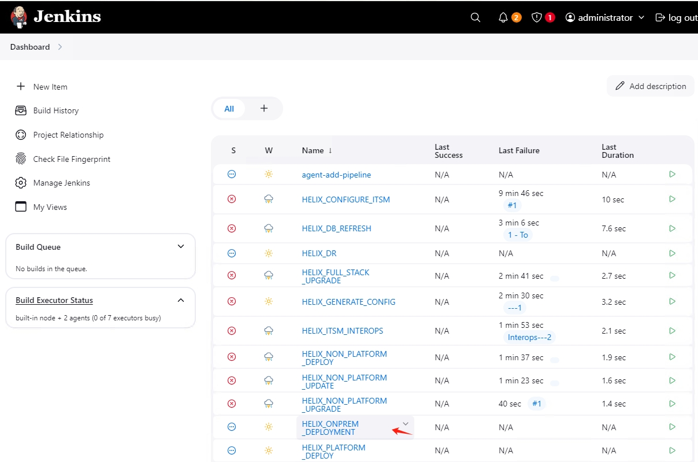

Click "Build with Parameters" on the left, fill in all the necessary parameters and click the Build button.

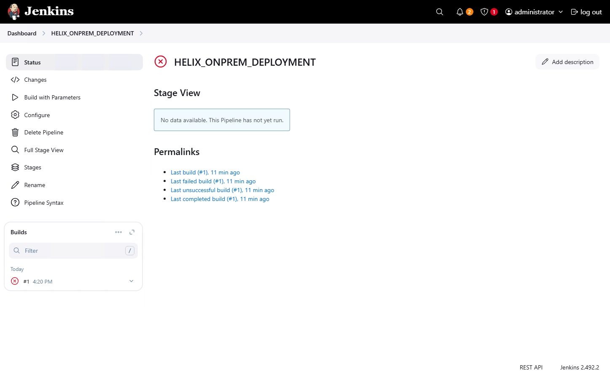

Parameter Description

**DEPLOYMENT ENGINE DETAILS** section:
| Parameter | Value | Desc |
| --- | --- | --- |
| CONTAINERIZED_DE | check | Containerized Deployment Engine |
| CUSTOM_BINARY_PATH | **Not Check** | git-<Jenkins server host name>. |
| AGENT| jenkins-agent | Node name. |
| CHECKOUT_USING_USER | github | GIT REPO Id from Credentials. |
| KUBECONFIG_CREDENTIAL | kubeconfig | Kubeconfig Credential |
| GIT_USER_HOME_DIR | /home/jenkins | Jenkins user home dir |
| GIT_REPO_DIR | http://gitea:3000/ciadmin | Git repo base directory path. |
| HELM_NODE | jenkins-agent | Helm Node. |

**ENVIRONMENT DETAILS** section:
| Parameter | Value | Desc |
| --- | --- | --- |
| IS_CLOUD | **NOT check**  | Kubernetes/Openshift is on cloud environment. |
| ROUTE_ENABLED | **NOT check**  | Do not select this check box. |
| ROUTE_TLS_ENABLED | **NOT check**  | Do not select this check box. |
| OS_RESTRICTED_SCC | **NOT check**  | OpenShift cluster have restricted security context constraints enabled. |
| DEPLOYMENT_TYPE| FRESH  | fresh installation |
| DEPLOYMENT_MODE | FULL  | Loads all available BMC Helix Service Management components and applications into memory |
| CLUSTER_CONTEXT | helix-compact | Specify the value of the Kubernetes cluster context. |
| CUSTOMER_NAME | itsmpoc | Specify the customer's full name |
| IS_NAMESPACE | helixis | Namespace to install BMC Helix Innovation Suite |
| CUSTOMER_SERVICE  | itsm |  |
| ENVIRONMENT | poc |  |
| INGRESS_CLASS | nginx |  |
| APPLICATION_PARENT_DOMAIN | bmc.local |  |
| ENABLE_RSSO_MULTI_DOMAIN | **NOT select** |  |
| INPUT_CONFIG_METHOD| **NOT select** |  |
| CUSTOM_CERTIFICATE | bmc.local.crt | Upload /root/openssl/bmc.local.crt |
| CACERTS_SSL_TRUSTSTORE_PASSWORD | **NOT change** | Leave this blank. Using default password changeit |
| DB_SSL_CERT | **NOT select** | Postgres DB which has SSL enabled. Provide root.crt file |
| ENVIRONMENT_SIZE | C | C stands for Compact |
| SOURCE_VERSION | NA | Only Applicable in case of DEPLOYMENT_MODE as UPDATE or UPGRADE |
| PLATFORM_HELM_VERSION | 2026101.1.00.00 | Target version of the Helm repositories |
| SMARTAPPS_HELM_VERSION | 2026101.1.00.00 | Smart applications version of the Helm repositories. |

**PRODUCTS** section:
| Parameter | Value | Desc |
| --- | --- | --- |
| HELIX_VIRTUALCHAT | check | Helix Live Chat |
| HELIX_OPENFIRE | check | Helix Openfire |
| HELIX_DWP | check | Helix Digital Workplace |
| HELIX_DWPA| check | Helix Digital Workplace Catalog|
| HELIX_CLOUD_ACTIONS | check | Cloud Action connectors |
| HELIX_BWF | check | Helix Business Workflows |
| HELIX_MCSM | check | Helix Multi-Cloud Broker |
| HELIX_ITSM_INSIGHTS| **NOT check** | Helix ITSM Insights, resoure consume high |
| HELIX_TSOMPLUGIN| **NOT check** | TrueSight Operations Management plug-ins |
| HELIX_SMARTAPPS_CSM | check | Helix Customer Service Management (CSM) |
| HELIX_SMARTAPPS_HPM | check | Helix Portfolio Management |
| HELIX_DRIFT_MANAGEMENTPLUGIN | check | Drift Management |
| HELIX_CLAMAV | check | |
| HELIX_NETOPS | check | |
| HELIX_GPT | check | BMC Helix GPT |
| HELIX_DSO | check | Distributed Server Option (DSO) service in BMC Helix Innovation Suite |
| BWF_DEPLOY_SAMPLE_CONTENT_PACK | **NOT check** | Only in the development environments. | 
| DWP_DEPLOY_SAMPLE_CONTENT_PACK | **NOT check** | Only in the development environments. | 
| CLOUDACTIONS_DEPLOY_SAMPLE_CONTENT_PACK | **NOT check** | Only in the development environments. | 
| HELIX_SCCM | check | Microsoft System Center Configuration Manager. | 
| HELIX_BCM| check | BMC Client Management. | 

**LOGGING CONFIGURATION** section:
| Parameter | Value | Desc |
| --- | --- | --- |
| SIDECAR_SUPPORT_ASSISTANT_FPACK | check | Support Assistant tool |
| SIDECAR_FLUENTBIT | check | Support Assistant tool |
| SIDECAR_FLUENT_DETAIL_LOG | check | Stream APIs, SQL, or filter logs to Elasticsearch |
| LOGS_ELASTICSEARCH_HOSTNAME | efk-elasticsearch-data-hl.bmc-helix-logging | efk-elasticsearch-data-hl.\<BMC Helix Logging namespace> |
| LOGS_ELASTICSEARCH_TLS | check | Select this check box. |
| LOGS_ELASTICSEARCH_PASSWORD | kibana$123| **KIBANA_PASSWORD** parameter in the **secrets.txt**|

**SERVICE ACCOUNT** section:
| Parameter | Value | Desc |
| --- | --- | --- |
| SUPPORT_ASSISTANT_CREATE_ROLE | check | Support Assistant Role. |
| SUPPORT_ASSISTANT_SERVICE_ACCOUNT | default | ervice account is used during the Support Assistant tool installation. |
| COMMON_IS_SERVICE_ACCOUNT| sa-is-common | common service account for all Service Management application pods. |
| ENABLE_PLATFORM_KEK_RBAC| check | create a service account, role, and role binding associated with the StatefulSet. |

**PIPELINES** section:
| Parameter | Value | Desc |
| --- | --- | --- |
| HELIX_GENERATE_CONFIG | check  | |
| HELIX_PLATFORM_DEPLOY | check | |
| HELIX_NONPLATFORM_DEPLOY | check | |
| HELIX_CONFIGURE_ITSM | check | |
| HELIX_SMARTAPPS_DEPLOY | check | |
| SUPPORT_ASSISTANT_TOOL | check | Support Assistant Tool Application (UI) |
| HELIX_INTEROPS_DEPLOY | check | Activate services for the BMC Helix Platform users|
| FULL_STACK_UPGRADE | **NOT check** |Check if DEPLOYMENT_MODE is UPGRADE |
| HELIX_POST_DEPLOY_CONFIG | **NOT check** | Do not select this parameter while installing the platform and applications |
| HELIX_DR | **NOT check** | Do not select this option. |
| SCALE_DOWN | **NOT check** | Do not select this option.|
| HELIX_RESTART | **NOT check** | Restart all the application pods |

**IMAGE REGISTRY DETAILS** section:
| Parameter | Value | Desc |
| --- | --- | --- |
| REGISTRY_TYPE | DTR| |
| HARBOR_REGISTRY_HOST | helix-harbor.bmc.local | |
| DIMAGE_REGISTRY_USERNAME | admin | |
| IMAGE_REGISTRY_PASSWORD | bmcAdm1n | Change Password |
| IMAGESECRET_NAME | isharbor-secret | Specify the name used to create Kubernetes image registry secret. |

**DATABASE DETAILS** section:
| Parameter | Value | Desc |
| --- | --- | --- |
| DB_TYPE | postgres | |
| DB_SSL_ENABLED | **NOT check** | select if encrypted DB connection is required. |
| DB_JDBC_URL | **BLANK** | JDBC URL to use an Oracle database connectio. |
| DB_PORT | 5432 | |
| ORACLE_SERVICE_NAME | **BLANK** | Oracle Service Name. |
| DATABASE_HOST_NAME | helix-svc.bmc.local| |
| DATABASE_ADMIN_USER | postgres | |
| DATABASE_ADMIN_PASSWORD | bmcAdm1n | |
| DATABASE_RESTORE | check | Database restore is required. |
| AR_DB_CASE_SENSITIVE | check | Import case-sensitive PostgreSQL database dumps by using the DATABASE_RESTORE option.. |
| IS_DATABASE_ALWAYS_ON | **NOT check** | Microsoft SQL database is in a high availability cluster. |
| AR_DB_NAME | is_db | Helix Innovation Suite database |
| AR_DB_USER | ARAdmin | Helix Innovation Suite database user |
| AR_DB_PASSWORD | AR#Admin# | Password for BMC Helix Innovation Suite user |
| PLATFORM_SR_DB_USER | **BLANK** | Leave this field blank. |
| PLATFORM_SR_DB_PASSWORD | **BLANK** | Leave this field blank. |
| PLATFORM_SR_DB_JDBC_URL | **BLANK** | Leave this field blank. |

**PRODUCT CONFIGURATIONS** section:
| Parameter | Value | Desc |
| --- | --- | --- |
| FTS_ELASTICSEARCH_HOSTNAME | opensearch-logs-data.helixade| |
| FTS_ELASTICSEARCH_PORT | 9200 | |
| FTS_ELASTICSEARCH_USERNAME | bmcuser | |
| FTS_ELASTICSEARCH_USER_PASSWORD | Es_L0g#p@SS | LOG_ES_PASSWD value in secrets.txt |
| FTS_ELASTICSEARCH_SECURE | check | |
| AR_LOCALE_TO_INSTALL | zh_CN | Supported locales are fr, de, it, es, ja, ko, zh_CN, pt_BR, he, ru, and pl. English locale is installed by default. It take approximately **2 hours** to install one locale.|
| BAKEDUSER_HANNAH_ADMIN_PASSWORD | Password_1234 | Password for BMC Helix Digital Workplace administrator user hannah_admin. The hannah_admin user in ADE is different from hannah_admin user in Innovation Suite  |
| AR_SERVER_APP_SERVICE_PASSWORD | AR#Admin# | Specify the password to access applications |
| AR_SERVER_DSO_USER_PASSWORD | AR#Admin# | Password to access the Distributed Server Option |
| AR_SERVER_MIDTIER_SERVICE_PASSWORD | AR#Admin# | Password to access the Mid Tier |

**PRODUCT CONFIGURATIONS** section:
| Parameter | Value | Desc |
| --- | --- | --- |
| SMARTREPORTING_DB_NAME | SR | BMC Helix ITSM: Smart Reporting database |
| SMARTREPORTING_DB_USER | SRAdmin | |
| SMARTREPORTING_DB_PASSWORD | AR#Admin# | |
| VC_RKM_USER_NAME | vc_admin | User name for Helix Virtual Agent |
| VC_RKM_PASSWORD | AR#Admin# | Password for the Helix Virtual Agent user |
| VC_PROXY_USER_LOGIN_NAME | vcp_admin | Proxy user login name for BMC Helix Virtual Agent |
| VC_PROXY_USER_PASSWORD | AR#Admin# | |
| DWP_CONFIG_PRIMARY_ORG_NAME | dwporg | Organization name for BMC Helix Digital Workplace |
| AR_SERVER_ALIAS | onbmc-s | Alias name of AR System server |
| PLATFORM_ADMIN_PLATFORM_EXTERNAL_IPS | [192.168.1.201,192.168.1.202,192.168.1.203] | External IP address to enable external access.The external IP must be in JSON list format within square brackets. |
| ENABLE_PLATFORM_INT_NORMALIZATION | **NOT check** | Do not select this check box. |
| MIDTIERCACHEBUILDER_TRIGGER_PRELOAD | check | Enable full data cache mode |
| MIDTIERCACHEBUILDER_SCHEDULE | 0 1 * * * | Specify a cron job schedule for the Mid Tier cache builder job. |
| AR_DATETIME | **BLANK** | Default system date and time is assigned.|
| AR_TIMEZONE | Asia/Shanghai | |
| ENABLE_EXTERNAL_SECRET_VAULT | **BLANK** | Select this check box to integrate and use a CyberArk vault for password management. |

**RSSO PARAMETERS** section:
| Parameter | Value | Desc |
| --- | --- | --- |
| RSSO_URL | https://lb.bmc.local/rsso | |
| RSSO_ADMIN_USER | Admin | |
| RSSO_ADMIN_PASSWORD | RSSO#Admin# | |
| TENANT_DOMAIN | adelab.\<TENANT-ID\> | Value of the **Tenant** parameter |

**ITSM INTEROPS PARAMETERS** section:
| Parameter | Value | Desc |
| --- | --- | --- |
| HELIX_PLATFORM_DOMAIN | bmc.local | |
| HELIX_PLATFORM_NAMESPACE | helixade | |
| HELIX_PLATFORM_CUSTOMER_NAME | adelab | |

**SELECT THE SERVICES FOR INTEROPERABILITY CONFIGURATION** section:
| Parameter | Value | Desc |
| --- | --- | --- |
| BMC_HELIX_ITSM_INSIGHTS | **NOT check** | |
| BMC_HELIX_SMART_IT | check | Enable BMC Helix ITSM: Smart IT. |
| BMC_HELIX_BWF | check | Enable BMC Helix Business Workflows. |
| BMC_HELIX_DWP | check | Enable BMC Helix Digital Workplace. |
| BMC_HELIX_INNOVATION_STUDIO | check | Enable BMC Helix Innovation Studio. |
| BMC_HELIX_DWPA | check | Enable BMC Helix Digital Workplace Catalog. |

**SPLUNK CONFIGURATION DETAILS** section:
| Parameter | Value | Desc |
| --- | --- | --- |
| SIDECAR_FLUENTBIT_OUTPUT_TYPE| **NOT check**| Select this check box. |
| SIDECAR_FLUENT_SPLUNK_HOSTNAME | **NOT check** | Specify the Splunk host name. |
| SIDECAR_FLUENT_SPLUNK_PORT| **NOT check** | Specify the Splunk port. |
| SIDECAR_FLUENT_OUTPUT_CUSTOM | **NOT check** | Specify the FluentBit output. |
| SIDECAR_FLUENT_SPLUNK_TOKEN | **NOT check** | Specify the Splunk token. |

After filling in the form, click Build to start executing the pipeline.

## 8 Install Helix Service Management
The pipeline usually does not succeed in one go. If an error occurs, we need to learn how to troubleshoot.

Hover the mouse over the stage where the error is reported and click the Logs window that pops up.
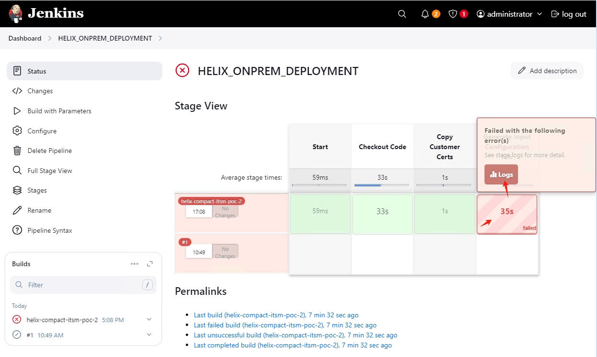

Click the last stage.
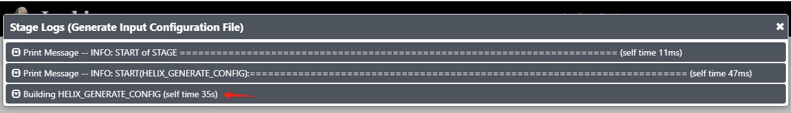

Click Console Output to see the output.
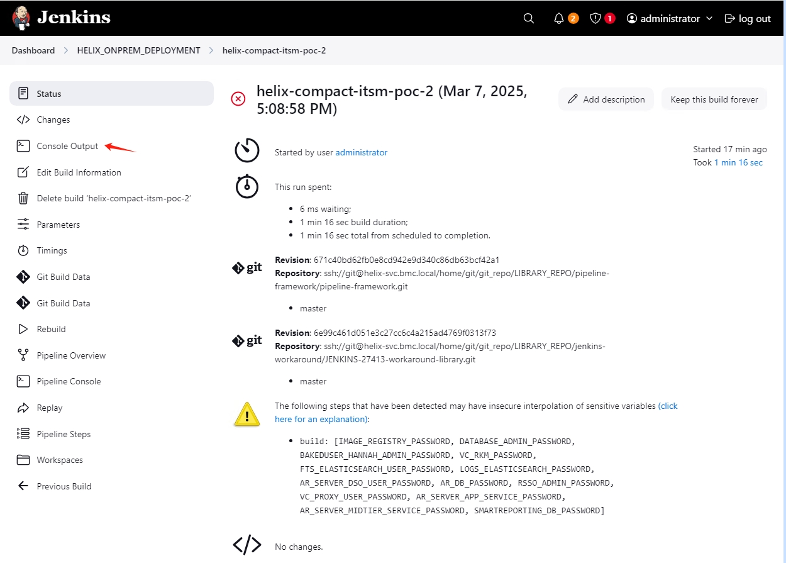

Scroll down to see the FAILURE.
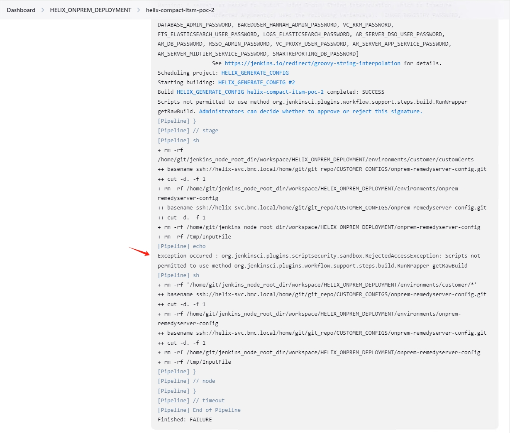

Below exception is pending approval issue
```
Exception occured : org.jenkinsci.plugins.scriptsecurity.sandbox.RejectedAccessException: Scripts not permitted to use method org.jenkinsci.plugins.workflow.support.steps.build.RunWrapper getRawBuild
```

Click Manage Jenkins tab on Jenkins Dashboard, In-process Script Approval.
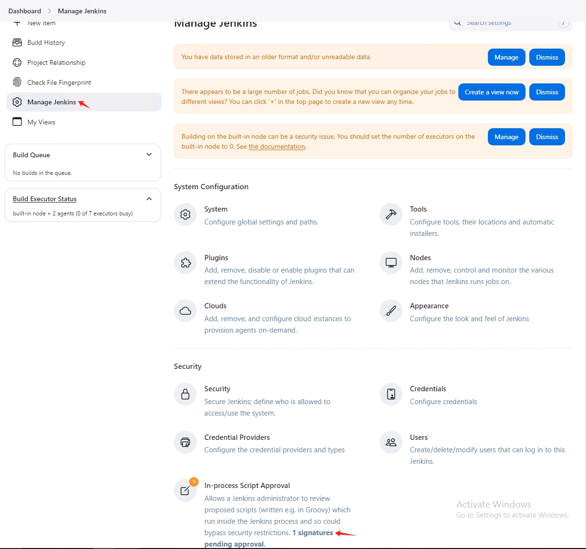

Clicke Approve button.
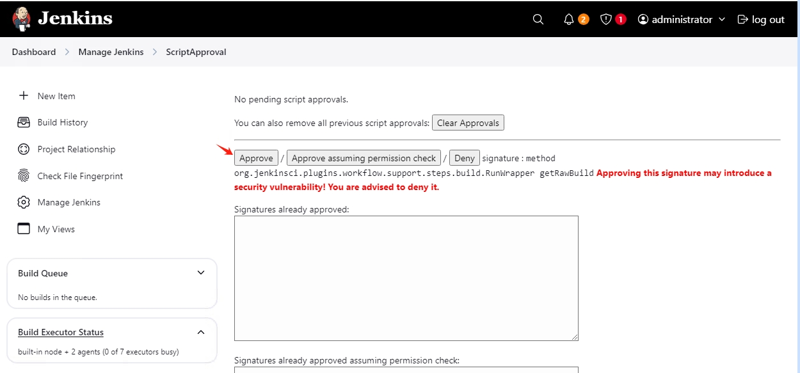

Go back to Jenkins Dashboard, select HELIX_ONPREM_DEPLOYMENT pipeline, select the last build.
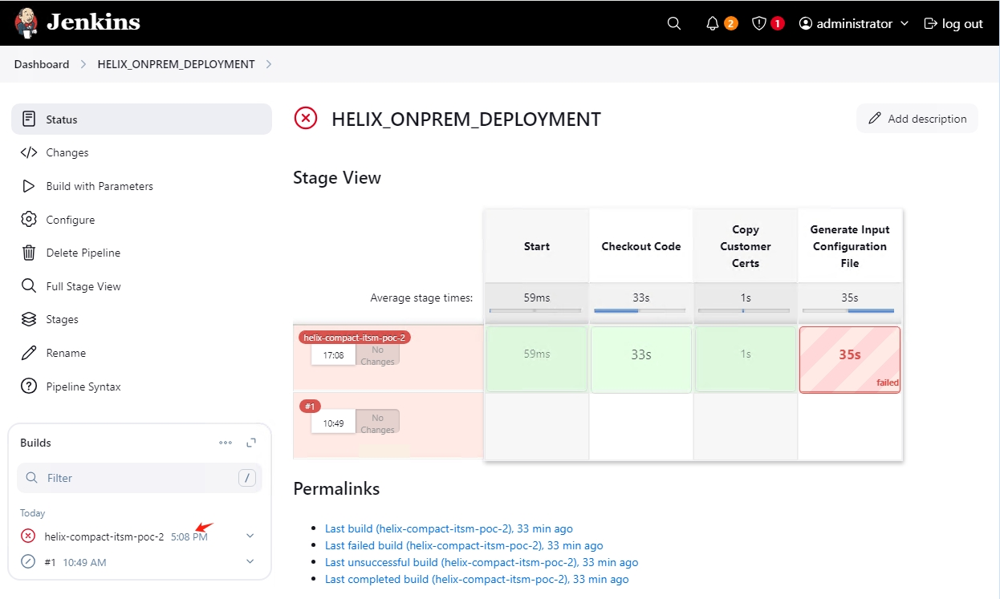

Clicke Rebuild on the left, scroll down to Rebuild. 
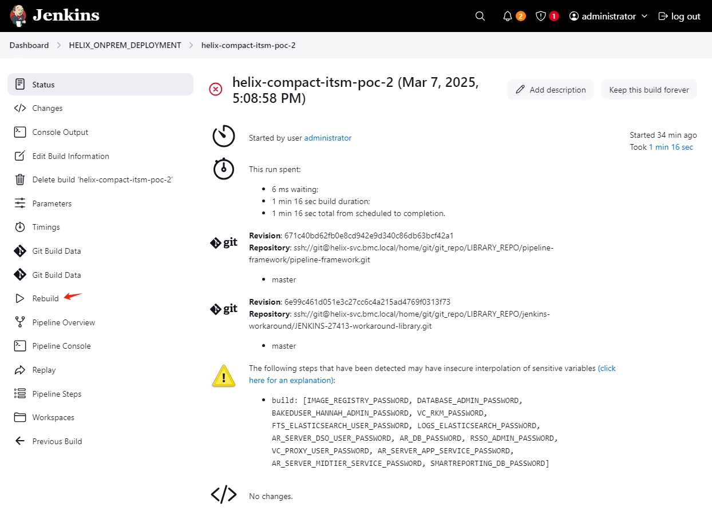

Repeat the process again and again until all issues are resolved and the HELIX_ONPREM_DEPLOYMENT pipeline is successfully executed.

During the installation project, you may encounter image pulling errors as shown in the figure below. 

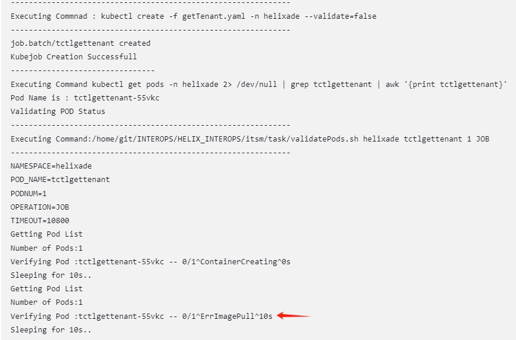

Use the following command to query the missing image file name and add it to the local image registry.
```
kubectl -n helixade describe pod <POD-NAME>
```

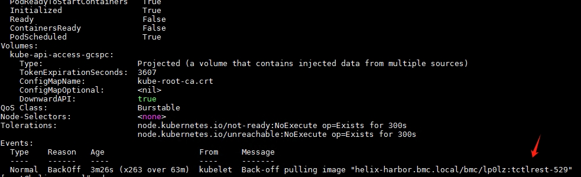


After the installation is complete, you will find that the hannah_admin account can no longer log in to the helix portal. That is because in Section 9, we have reset the password to hannah_admin using the parameter BAKEDUSER_HANNAH_ADMIN_PASSWORD.

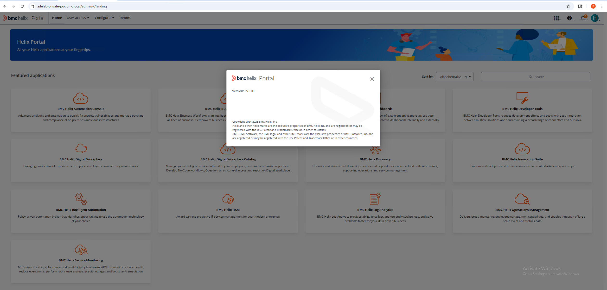


* Mid Tier
```
https://itsm-poc.bmc.local/arsys
```
hannah_admin/hannah_admin

* CMDB
```
https://itsm-poc-restapi.bmc.local/cmdb/index.html
```
hannah_admin/hannah_admin

* BMC Live Chat
```
https://itsm-poc-vchat.bmc.local
```
admin 

* Openfire
```
https://itsm-poc-chat.bmc.local
```

admin 


