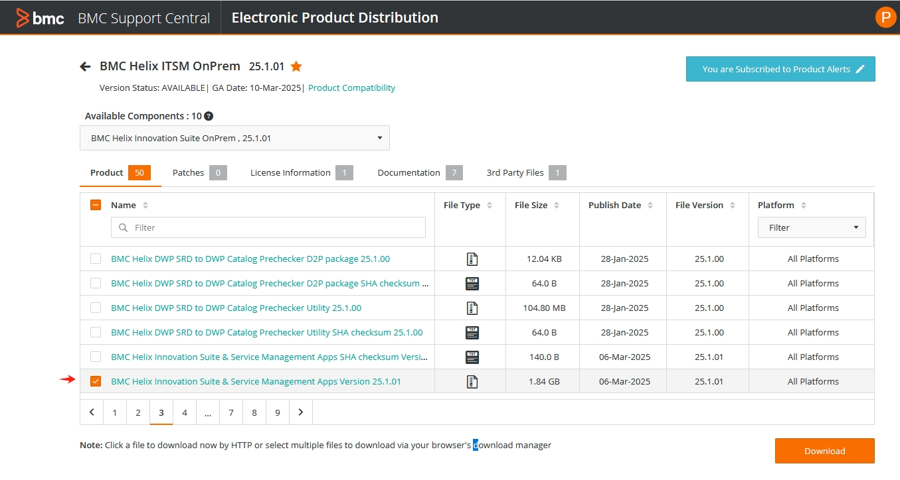
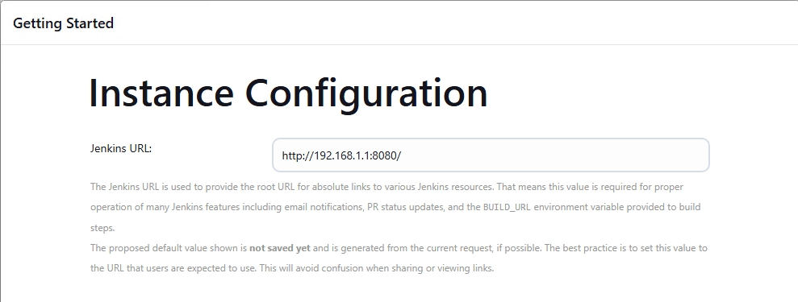
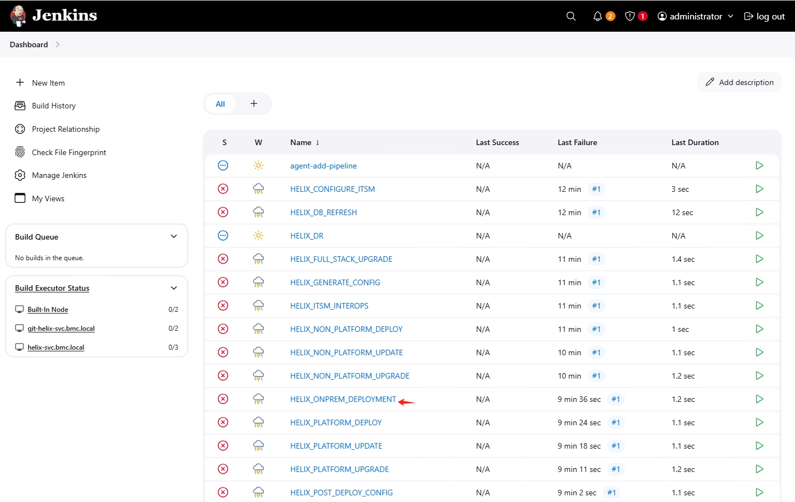
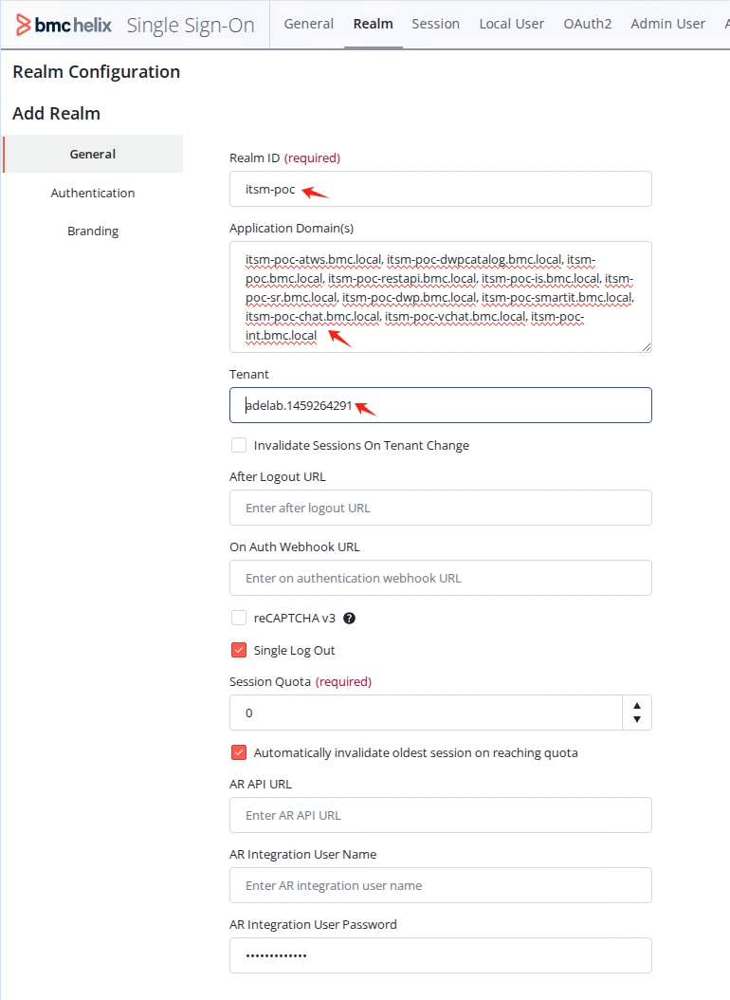

# BMC Helix ITOM & ITSM OnPrem Installation Step by Step 3 - ITSM

- [BMC HelixOM ITOM & ITSM OnPrem Installation Step by Step 3 - ITSM](#bmc-helixom-itom-&-itsm-onprem-installation-step-by-step-3---itsm)
  - [1 Download installation file](#1-download-installation-file)
  - [2 Sync Helix ITSM images to local Harbor](#2-sync-helix-itsm-images-to-local-harbor)
  - [3 Setup PostgreSQL database](#3-setup-postgresql-database)
  - [4 Setup Helix Deployment Engine](#4-setup-helix-deployment-engine)
  - [5 Dry run Pipeline](#5-dry-run-pipeline)
  - [6 Create a self-signed or custom CA certificate](#6-create-a-self-signed-or-custom-ca-certificate)
  - [7 Setup Installation environment](#7-setup-installation-environment)
  - [8 Install Helix Platform Common services](#8-install-helix-platform-common-services)
  - [9 Config HELIX_ONPREM_DEPLOYMENT pipeline](#9-config-helix_onprem_deployment-pipeline)
  - [10 Install Helix Service Management](#10-install-helix-service-management)


**Attention**! The installation of Helix Innovation Suite(ITSM) depends on Helix Platform Common services. Please refer to [BMC-Helix-OnPrem-Installation-2-ITOM](https://github.com/rivertb/BMC-Helix-OnPrem-Installation-2-ITOM?tab=readme-ov-file) and complete at least the section of "2 Deploy Helix Dashboard".

## 1 Download installation file
You obtain the BMC Helix Service Management installation files by downloading them from the BMC Electronic Product Distribution (EPD) website.

* Git repositories and artifacts that are used for BMC Helix Service Management installation
* Deployment manager that is used for BMC Helix Platform Common Services installation (Already download in [ITOM](https://github.com/rivertb/BMC-Helix-OnPrem-Installation-2-ITOM) project)

In the BMC Helix Innovation Suite OnPrem page, on the Product tab, select BMC Helix Innovation Suite & Service Management Apps latest version, such as  BMC Helix Innovation Suite & Service Management Apps latest version, such as 25.2.01 , and click Download.


The BMC_Helix_Innovation_Suite_And_Service_Management_Apps_Version_25.2.01.zip file contains the following files:

* BMC_Remedy_Deployment_Engine_Setup_25.2.01.zip—This file contains BMC Deployment Engine set up files.
* BMC_Remedy_Deployment_Manager_Configuration_Release_25.2.01.zip—This file contains the installation artifacts.
* image_pull_push.sh and image_sync_to_private_registry.sh—These files contain the scripts to synchronize your Harbor repository with BMC Helix Innovation Suite and BMC Helix Platform services container images in BMC DTR.

## 2 Sync Helix ITSM images to local Harbor

The latest list of images required for BMC Helix Service Management installation can be download from [here](https://docs.bmc.com/xwiki/bin/view/Service-Management/On-Premises-Deployment/BMC-Helix-Service-Management-Deployment/brid25201/Installing/Preparing-for-installation/Setting-up-a-Harbor-repository-to-synchronize-container-images/), including:
 * 25201_ITSM_Platform_Images.txt
 * 25201_ITSM_SmartApps_Images.txt
 * 25201_ITSM_Pipeline_Images.txt
 * 25201_SupportAssistTool_Images.txt
 * 252_Helix_Platform_Images.txt
 * 210503HF12_SmartReporting_Images.txt

You can also copy from ~/BMC-Helix-OnPrem-Installation-1-Env/helix-itsm-images-files-25.2.01.
```
cp -R ~/BMC-Helix-OnPrem-Installation-1-Env/helix-itsm-images-files-25.2.01 /root/.
cd /root/helix-itsm-images-files-25.2.01
chmod a+x *.sh
dnf install dos2unix -y
dos2unix *.txt
ls -l

-rw-r--r-- 1 root root  258 Jul 24 13:43 210503HF12_SmartReporting_Images.txt
-rw-r--r-- 1 root root 2236 Jul 24 13:43 25201_ITSM_Pipeline_Images.txt
-rw-r--r-- 1 root root 3250 Jul 24 13:43 25201_ITSM_Platform_Images.txt
-rw-r--r-- 1 root root 1587 Jul 24 13:43 25201_ITSM_SmartApps_Images.txt
-rw-r--r-- 1 root root  113 Jul 24 13:43 25201_SupportAssistTool_Images.txt
-rw-r--r-- 1 root root 5188 Jul 24 13:43 252_Helix_Platform_Images.txt
-rw-r--r-- 1 root root 1026 Jul 24 13:43 image_pull_push.sh
-rw-r--r-- 1 root root 2570 Jul 24 13:43 image_sync_to_private_registry.sh
```
Synchronize the Helix ITSM images from https://containers.bmc.com to local Harbor server.
```
cat 210503HF12_SmartReporting_Images.txt > images.txt
cat 25201_ITSM_Pipeline_Images.txt >> images.txt
cat 25201_ITSM_Platform_Images.txt >> images.txt
cat 25201_ITSM_SmartApps_Images.txt >> images.txt
cat 25201_SupportAssistTool_Images.txt >> images.txt

nohup ./image_sync_to_private_registry.sh > nohup.out &
tail -f nohup.out
```
The image synchronization process may take several hours to one day.

## 3 Setup PostgreSQL database

BMC Helix Service Management supports both case-insensitive and sensitive PostgreSQL13.x and 17.x databases. You must set up your PostgreSQL database before you deploy the BMC Helix Innovation Suite platform and applications. For detailed instructions on installing the postgresql database, please refer to:[Install PostgreSQL on Linux](https://www.postgresql.org/download/linux/redhat/)
```
sudo dnf install -y https://download.postgresql.org/pub/repos/yum/reporpms/EL-9-x86_64/pgdg-redhat-repo-latest.noarch.rpm  
sudo dnf -qy module disable postgresql  
sudo dnf install -y postgresql17-server  
sudo /usr/pgsql-17/bin/postgresql-17-setup initdb  
sudo systemctl enable postgresql-17  
sudo systemctl start postgresql-17
```
Install postgres-contrib by using the following command:
```
yum install postgres*contrib -y
```
Update the pg_hba.conf file and postgresql.conf file:
```
sudo su postgres <<'EOF'
psql -c "ALTER USER postgres with encrypted password 'bmcAdm1n'"
echo "[INFO]: editing pg_hba.conf"
sed -i '/^local   all/c\local   all             all                                     scram-sha-256' /var/lib/pgsql/15/data/pg_hba.conf
sed -i '/^host    all             all             127.0.0.1/c\host    all             all             0.0.0.0\/0            scram-sha-256' /var/lib/pgsql/15/data/pg_hba.conf
echo "[INFO]: editing postgresql.conf"
sed -i "/^#listen_addresses = 'localhost'/c \listen_addresses = '*'" /var/lib/pgsql/17/data/postgresql.conf
sed -i '/^#password_encryption = scram-sha-256/c \password_encryption = scram-sha-256' /var/lib/pgsql/17/data/postgresql.conf
sed -i '/^max_connections = 100/c \max_connections = 600' /var/lib/pgsql/17/data/postgresql.conf
sed -i '/^#random_page_cost = 4.0/c \random_page_cost = 1.1' /var/lib/pgsql/17/data/postgresql.conf
EOF
```
Restart PostgreSQL database 
```
systemctl restart postgresql-17
```
Add firewall rule for postgresql database
```
firewall-cmd --zone=internal --permanent --add-service=postgresql
firewall-cmd --zone=external --permanent --add-service=postgresql
firewall-cmd --reload
```
Check the database server parameter value for max_connections
```
sudo su postgres <<'EOF'
export PGPASSWORD=bmcAdm1n
psql -U postgres -c "show max_connections;"
EOF
```


## 4 Setup Helix Deployment Engine
### 4.1 Update libraries and packages

Update your system libraries and packages to the latest available version
```
#Update OS
sudo yum update -y
sudo yum upgrade -y
sudo yum clean all

#Install perl
sudo yum install perl -y

#Set up Perl-Data-Dumper package
sudo yum makecachesudo 
yum -y install perl-Data-Dumper
```
### 4.2 Create and configure users
Perform the following steps to add the users:
```
sudo useradd git -m
echo "git:bmcAdm1n" | chpasswd

sudo useradd jenkins -m
echo "jenkins:bmcAdm1n" | chpasswd
```


### 4.3 Configure passwordless sudo access for git
Create a sudoers override file:
```
cat > /etc/sudoers.d/git_sudoers <<-EOF
git ALL=(ALL) NOPASSWD: \
    /usr/sbin/alternatives, \
    /usr/bin/cat, \
    /usr/bin/chmod, \
    /usr/bin/chown, \
    /usr/bin/cp, \
    /usr/bin/curl, \
    /usr/bin/dnf, \
    /usr/bin/dos2unix, \
    /usr/bin/grep, \
    /usr/bin/java, \
    /usr/bin/ln, \
    /usr/bin/ls, \
    /usr/bin/mkdir, \
    /usr/bin/mv, \
    /usr/bin/netstat, \
    /usr/bin/rpm, \
    /usr/bin/sed, \
    /usr/bin/su, \
    /usr/bin/sha256sum, \
    /usr/sbin/subscription-manager, \
    /usr/bin/systemctl, \
    /usr/bin/unzip, \
    /usr/bin/crb, \
    /usr/sbin/update-alternatives, \
    /usr/bin/wget, \
    /usr/bin/yum
EOF
#Verify that the file has no errors
visudo -c -f /etc/sudoers.d/git_sudoers

#Modify access to sudoers file
chmod 440 /etc/sudoers.d/git_sudoers

#Switch the user to git user, and validate passwordless sudo access
su - git
sudo ls /root
```

### 4.4 Copy the ssh keys
```
su - git

#Generate the SSH key
ssh-keygen
#Tribouble enter to select default value

ssh-copy-id git@helix-svc.bmc.local
#enter yes and bmcAdm1n as password

ssh git@helix-svc.bmc.local

su - jenkins
ssh-keygen
#Tribouble enter to select default value

ssh-copy-id git@helix-svc.bmc.local
ssh git@helix-svc.bmc.local
#enter yes and bmcAdm1n as password

```

### 4.5 Add the kubeconfig file

```
su - git
mkdir /home/git/.kube
sudo cp cp /root/.kube/config /home/git/.kube/.

#Verify kubectl tool works
kubectl get nodes
```
### 4.6 Run the BMC Deployment Engine automation script


Copy the BMC_Helix_Innovation_Suite_And_Service_Management_Apps_Version_25.2.01.zip file downloaded from EPD and extract the files to the git user home directory

```
#Switch to the git user
su - git
unzip ./BMC_Helix_Innovation_Suite_And_Service_Management_Apps_Version_25.2.01.zip
unzip ./BMC_Remedy_Deployment_Engine_Setup_25.2.01.zip
cd DE1.0
```
Update build.properties and customize the following parameters:
* ITSM_REPO_GIT_ZIP
* JENKINS_CONFIG_FILES_ZIP_PATH
* LIBRARY_REPO_ZIP_PATH
* DB_TYPE
* JENKINS_HOSTNAME
* KUBERNETES_VERSION
* POSTGRES_VERSION
* HELM_VERSION
```
sed -i "/^ITSM_REPO_GIT_ZIP/c \ITSM_REPO_GIT_ZIP=/home/git/BMC_Remedy_Deployment_Manager_Configuration_Release_25.2.01.zip" /home/git/DE1.0/build.properties
sed -i "/^JENKINS_CONFIG_FILES_ZIP_PATH/c \JENKINS_CONFIG_FILES_ZIP_PATH=/home/git/Jenkins_Config_Files.zip" /home/git/DE1.0/build.properties
sed -i "/^LIBRARY_REPO_ZIP_PATH/c \LIBRARY_REPO_ZIP_PATH=/home/git/LIBRARY_REPO.zip" /home/git/DE1.0/build.properties
sed -i "/^DB_TYPE/c \DB_TYPE=postgres" /home/git/DE1.0/build.properties
sed -i "/^JENKINS_HOSTNAME/c \JENKINS_HOSTNAME=helix-svc.bmc.local" /home/git/DE1.0/build.properties
sed -i "/^KUBERNETES_VERSION/c \KUBERNETES_VERSION=1.32.4" /home/git/DE1.0/build.properties
sed -i "/^POSTGRES_VERSION/c \POSTGRES_VERSION=17" /home/git/DE1.0/build.properties
sed -i "/^HELM_VERSION/c \HELM_VERSION=3.17.1" /home/git/DE1.0/build.properties
```

After updating the build.properties file, run the BMC Deployment Engine automation script to set up the Jenkins job pipeline framework.
```
perl setup-Helix-ITSM-onPrem.pl  2>&1 | tee ~/BMC-HELIX-DE-AUTO.log.$$
```
The Jenkins job pipeline framework installed.


Add firewall rule for jenkins
```
firewall-cmd --add-port=8080/tcp --zone=internal --permanent 
firewall-cmd --add-port=8080/tcp --zone=external --permanent 
firewall-cmd --reload
```

### 4.7 Post-installation configuration

Login to Jenkins console. The password for admin can be find in the ~/BMC-HELIX-DE-AUTO.log.$$ file.


On the Jenkins User Interface, select Install Suggested Plugins


Get started to install plugins.


Create the first admin user.


Save Jenkins URL.


The default Jenkins dashboard.


Download kubeconfig file from Rancher console.


Login to http://192.168.1.1:8080/credentials.


Select kubeconfig.yaml (kubeconfig), Update->Replace->Choose kubeconfig file just download from Rancher console.


Input password for the below credentials:
* git/****** (github): Update->Change Password->bmcAdm1n
* git/****** (ansible_host): Update->Change Password->bmcAdm1n
* git/****** (ansible): Update->Change Password->bmcAdm1n
* git/****** (Credentials of git): Update->Change Password->bmcAdm1n

Check Node Status. 
Goto http://192.168.1.1:8080/computer, Refresh Status, the nodes will start automatically. Or click Configure, select git user as Credentials and Launch Agent.


Add Jenkins libraries.
Jenkins home page->Manage Jenkins->System->Scrolldown to "Global Trusted Pipeline Libraries"->Add


* Name: pipeline-framework
* Default version: master
* Load implicitly: Checked
* Project Repository: ssh://git@helix-svc.bmc.local/home/git/git_repo/LIBRARY_REPO/pipeline-framework/pipeline-framework.git
* Credentials: Git/****** (Credentials of git)


Click Add button to add another Library, save the change.

* Name: JENKINS-27413-workaround-library
* Default version: master
* Load implicitly: Checked
* Project Repository: ssh://git@helix-svc.bmc.local/home/git/git_repo/LIBRARY_REPO/jenkins-workaround/JENKINS-27413-workaround-library.git
* Credentials: Git/****** (Credentials of git)


## 5 Dry run Pipeline
Dry-run deployment pipelines. This is a mandatory step to update the pipeline configuration for any changes to the BMC Helix Service Management installer.

* Navigate to Jenkins Dashboards to view all the pipelines required for deployment.
* Select each pipeline and click Build with Parameters.
* In the AGENT parameter(Only in HELIX_ONPREM_DEPLOYMENT), provide the value of the node that has the name git-helix-svc.bmc.local
* Click Build.The build job will fail, which is expected.

Below two pipelines do NOT require a dry-run
* agent-add-pipeline
* HELIX_DR

Select HELIX_CONPREM_DEPLOYMENT.


Click Build with Parameters.


Input agent.


Check out all under PRODUCT_DEPLOY section.


Build job failed as expected.


Go to Dashboard->Manage Jenkins->In-process Script Approval.


Click Approve button.


## 6 Create a self-signed or custom CA certificate
We can use a self-signed certificate as a security certificate for BMC Helix Innovation Suite and Service Management applications.
Get the key store file cacerts 
```
cp /root/BMC-Helix-OnPrem-Installation-1-Env/certs/cacerts /root/openssl/.
```
Import public key file to key store
```
cd /root/openssl
keytool -importcert -v -alias helix -file /root/openssl/bmc.local.crt -keystore /root/openssl/cacerts
```

Enter the password as changeit and yes to trust this certificate.
```
keytool -importcert -v -alias helix -file /root/openssl/bmc.local.crt -keystore /root/openssl/cacerts
Enter keystore password:
Owner: C=CN, O=BMCSoftware, CN=*.bmc.local
Issuer: C=CN, O=BMCSoftware, CN=BMC-CA
Serial number: 4b1d7bace2a9b937ae653b7f392e46ebe7ce522
Valid from: Thu Feb 27 13:24:53 CST 2025 until: Sun Feb 25 13:24:53 CST 2035
Certificate fingerprints:
         SHA1: 85:DF:A7:E6:BE:57:2F:66:5E:B4:DE:D4:7A:F0:3A:D0:33:B8:2A:66
         SHA256: 0F:C6:40:F0:AA:DB:2B:23:C4:85:7A:E8:B4:75:9B:82:1C:DC:32:BB:30:22:86:0B:98:FB:82:75:2B:00:FC:A1
Signature algorithm name: SHA256withRSA
Subject Public Key Algorithm: 2048-bit RSA key
Version: 3

Extensions:

#1: ObjectId: 2.5.29.17 Criticality=false
SubjectAlternativeName [
  DNSName: *.bmc.local
  DNSName: helix-harbor.bmc.local
  DNSName: helix-discovery.bmc.local
  DNSName: helix-bhii.bmc.local
]

Trust this certificate? [no]:  yes
Certificate was added to keystore
[Storing /root/openssl/cacerts]
```
We get the new cacerts with public key stored. It will be upload to Jenkins pipeline.

## 7 Setup Installation environment
### 7.1 Verifying DNS for applications
We have configured DNS for the BMC Helix Service Management applications so that we can access the applications by using the following URL format. 
* Mid Tier: \<CUSTOMER_SERVICE\>-\<ENVIRONMENT\>.<CLUSTER_DOMAIN>
* Mid Tier integration: \<CUSTOMER_SERVICE\>-\<ENVIRONMENT\>-int.<CLUSTER_DOMAIN>
* Smart IT: \<CUSTOMER_SERVICE\>-\<ENVIRONMENT\>-smartit.<CLUSTER_DOMAIN>
* Smart Reporting: \<CUSTOMER_SERVICE\>-\<ENVIRONMENT\>-sr.<CLUSTER_DOMAIN>
* Innovation Studio: \<CUSTOMER_SERVICE\>-\<ENVIRONMENT\>-is.<CLUSTER_DOMAIN>
* Innovation Suite REST API or CMDB: \<CUSTOMER_SERVICE\>-\<ENVIRONMENT\>-restapi.<CLUSTER_DOMAIN>
* Atrium Web Services: \<CUSTOMER_SERVICE\>-\<ENVIRONMENT\>-atws.<CLUSTER_DOMAIN>
* Digital Workplace: \<CUSTOMER_SERVICE\>-\<ENVIRONMENT\>-dwp.<CLUSTER_DOMAIN>
* Digital Workplace Catalog: \<CUSTOMER_SERVICE\>-\<ENVIRONMENT\>-dwpcatalog.<CLUSTER_DOMAIN>
* Live Chat: \<CUSTOMER_SERVICE\>-\<ENVIRONMENT\>-vchat.<CLUSTER_DOMAIN>
* Openfire Chat: \<CUSTOMER_SERVICE\>-\<ENVIRONMENT\>-chat.<CLUSTER_DOMAIN>
* Support Assistant tool: \<CUSTOMER_SERVICE\>-\<ENVIRONMENT\>-supportassisttool.<CLUSTER_DOMAIN>

```
ping -c 4 itsm-poc.bmc.local
ping -c 4 itsm-poc-int.bmc.local
ping -c 4 itsm-poc-smartit.bmc.local
ping -c 4 itsm-poc-sr.bmc.local
ping -c 4 itsm-poc-is.bmc.local
ping -c 4 itsm-poc-restapi.bmc.local 
ping -c 4 itsm-poc-atws.bmc.local
ping -c 4 itsm-poc-dwp.bmc.local
ping -c 4 itsm-poc-dwpcatalog.bmc.local
ping -c 4 itsm-poc-vchat.bmc.local
ping -c 4 itsm-poc-chat.bmc.local
ping -c 4 itsm-poc-supportassisttool.bmc.local
```

### 7.2 Configure Helix Single Sign-On

Log in to BMC Helix Single Sign-On

* URL: lb.bmc.local/rsso
* Username: Admin
* Password: RSSO#Admin#


Click Tenant menu, select the SAAS_TENANT, click "Select Tenant" under Action column, the "Tenant SAAS_TENANT is selected" confirmation message is displayed on the screen.
Copy another tenant name of adelab.\<TENANT-ID\> for later use.


On the main menu, click Realm.


In the General tab, enter the following details:

| Filed | Value | Desc |
| --- | --- | --- |
| Realm ID | itsm-poc | \<CUSTOMER_SERVICE\>-\<ENVIRONMENT\> |
| Application Domain(s) | itsm-poc-atws.bmc.local, itsm-poc-dwpcatalog.bmc.local, itsm-poc.bmc.local, itsm-poc-restapi.bmc.local, itsm-poc-is.bmc.local, itsm-poc-sr.bmc.local, itsm-poc-dwp.bmc.local, itsm-poc-smartit.bmc.local, itsm-poc-chat.bmc.local, itsm-poc-vchat.bmc.local, itsm-poc-int.bmc.local |  |
| Tenant | adelab.\<TENANT-ID\> | paste the tenant name |



Click Authentication on the left tab, and enter the following details:

* Authentication Type: AR Server
* Host: platform-user-ext.helixis, helixis is the Helix Innovation Suite namespace
* Port: 46262 fix value

| Field | Value | Desc |
| --- | --- | --- |
| Authentication Type | AR Server |  |
| Host | platform-user-ext.helixis | helixis is the namespace of Helix Innovation Suite |
| Port | 46262 | Port Number – 46262 |


## 8 Install Helix Platform Common services

Change value setting in /root/helix-on-prem-deployment-manager-25.2/configs/deployment.config

| Line No. | Parameter | Value |
| --- | --- | --- |
| 48 | LOG_ANALYTICS_SERVICES | yes |
| 57 | ARSERVICES | yes |

Execute Deployment Manager script
```
/root/helix-on-prem-deployment-manager-25.2/deployment-manager.sh
```

## 9 Config HELIX_ONPREM_DEPLOYMENT pipeline
On Jenkins Dashboard, click the HELIX_ONPREM_DEPLOYMENT pipeline.


Click "Build with Parameters" on the left, fill in all the necessary parameters and click the Build button.


Parameter Description

**DEPLOYMENT ENGINE DETAILS** section:
| Parameter | Value | Desc |
| --- | --- | --- |
| CUSTOM_BINARY_PATH | **NOT check** | Custom Binary Path to pick binaries |
| AGENT | git-helix-svc.bmc.local | git-<Jenkins server host name>. |
| CHECKOUT_USING_USER | github | Jenkins credential ID that contains the Git credentials. |
| KUBECONFIG_CREDENTIAL | git-helix-svc.bmc.local | Provide KubeConfig Id from Credentials. |
| GIT_USER_HOME_DIR | /home/git | Git user home directory |
| GIT_REPO_DIR | ssh://helix-svc.bmc.local/home/git/git_repo | Directory that contains all the Git repositories |
| HELM_NODE | helix-svc.bmc.local  | Host name of the Jenkins server installed HELM. |

**ENVIRONMENT DETAILS** section:
| Parameter | Value | Desc |
| --- | --- | --- |
| IS_CLOUD | **NOT check**  | Kubernetes/Openshift is on cloud environment. |
| ROUTE_ENABLED | **NOT check**  | Do not select this check box. |
| ROUTE_TLS_ENABLED | **NOT check**  | Do not select this check box. |
| OS_RESTRICTED_SCC | **NOT check**  | OpenShift cluster have restricted security context constraints enabled. |
| DEPLOYMENT_MODE | FRESH  | fresh installation |
| CLUSTER | helix-compact | Find the cluster from the kubeconfig file |
| CUSTOMER_NAME | itsmpoc | Specify the customer's full name |
| IS_NAMESPACE | helixis | Namespace to install BMC Helix Innovation Suite |
| CUSTOMER_SERVICE  | itsm |  |
| ENVIRONMENT | poc |  |
| INGRESS_CLASS | nginx |  |
| CLUSTER_DOMAIN | bmc.local |  |
| INPUT_CONFIG_METHOD | **NOT select** |  |
| INPUT_CONFIG_FILE | **NOT select** |  |
| CACERTS_FILE | cacerts | Upload cacerts with public certificate create in section 6 |
| CACERTS_SSL_TRUSTSTORE_PASSWORD | **NOT change** | Leave this blank. Using default password changeit |
| DB_SSL_CERT | **NOT select** | Postgres DB which has SSL enabled. Provide root.crt file |
| CUSTOMER_SIZE | C | C stands for Compact |
| SOURCE_VERSION | NA | Only Applicable in case of DEPLOYMENT_MODE as UPDATE or UPGRADE |
| PLATFORM_HELM_VERSION | 2025101.1.00.00 | Target version of the Helm repositories |
| SMARTAPPS_HELM_VERSION | 2025101.1.00.00 | Smart applications version of the Helm repositories. |

**PRODUCTS** section:
| Parameter | Value | Desc |
| --- | --- | --- |
| HELIX_VIRTUALCHAT | check | Helix Live Chat |
| HELIX_OPENFIRE | check | Helix Openfire |
| HELIX_DWP | check | Helix Digital Workplace |
| HELIX_DWPA| check | Helix Digital Workplace Catalog|
| HELIX_CLOUD_ACTIONS | check | Cloud Action connectors |
| HELIX_BWF | check | Helix Business Workflows |
| HELIX_MCSM | check | Helix Multi-Cloud Broker |
| HELIX_ITSM_INSIGHTS| **NOT check** | Helix ITSM Insights, resoure consume high |
| HELIX_TSOMPLUGIN| **NOT check** | TrueSight Operations Management plug-ins |
| HELIX_SMARTAPPS_CSM | check | Helix Customer Service Management (CSM) |
| HELIX_SMARTAPPS_FAS | check | Helix Portfolio Management |
| HELIX_DRIFT_MANAGEMENTPLUGIN | check | Drift Management |
| HELIX_CLAMAV | **NOT check** | |
| HELIX_NETOPS | **NOT check** | |
| HELIX_GPT | check | |
| BWF_DEPLOY_SAMPLE_CONTENT_PACK | **NOT check** | Only in the development environments. | 
| DWP_DEPLOY_SAMPLE_CONTENT_PACK | **NOT check** | Only in the development environments. | 
| CLOUDACTIONS_DEPLOY_SAMPLE_CONTENT_PACK | **NOT check** | Only in the development environments. | 

**LOGGING CONFIGURATION** section:
| Parameter | Value | Desc |
| --- | --- | --- |
| SIDECAR_SUPPORT_ASSISTANT_FPACK | check | Support Assistant tool |
| SIDECAR_FLUENTBIT | check | Support Assistant tool |
| SIDECAR_FLUENT_DETAIL_LOG | check | Stream APIs, SQL, or filter logs to Elasticsearch |
| LOGS_ELASTICSEARCH_HOSTNAME | efk-elasticsearch-data-hl.helixade | |
| LOGS_ELASTICSEARCH_TLS | check | Select this check box. |
| LOGS_ELASTICSEARCH_PASSWORD | kibana123| **KIBANA_PASSWORD** parameter in the **secrets.txt**|

**SERVICE ACCOUNT** section:
| Parameter | Value | Desc |
| --- | --- | --- |
| SUPPORT_ASSISTANT_CREATE_ROLE | check | Support Assistant tool creates a role and role binding |
| SUPPORT_ASSISTANT_SERVICE_ACCOUNT | default | Default service account for Support Assistant tool installation |
| ENABLE_PLATFORM_KEK_RBAC | check | To create a service account, role, and role binding for key encryption key (KEK) automatically through pipeline. |

**PIPELINES** section:
| Parameter | Value | Desc |
| --- | --- | --- |
| HELIX_GENERATE_CONFIG | check  | |
| HELIX_PLATFORM_DEPLOY | check | |
| HELIX_NONPLATFORM_DEPLOY | check | |
| HELIX_CONFIGURE_ITSM | check | |
| HELIX_SMARTAPPS_DEPLOY | check | |
| SUPPORT_ASSISTANT_TOOL | check | Support Assistant Tool Application (UI) |
| HELIX_INTEROPS_DEPLOY | check | Activate services for the BMC Helix Platform users|
| FULL_STACK_UPGRADE | **NOT check** |Check if DEPLOYMENT_MODE is UPGRADE |
| HELIX_POST_DEPLOY_CONFIG | **NOT check** | Do not select this parameter while installing the platform and applications |
| HELIX_DR | **NOT check** | Do not select this option. |
| SCALE_DOWN | **NOT check** | Do not select this option.|
| HELIX_RESTART | **NOT check** | Restart all the application pods |

**IMAGE REGISTRY DETAILS** section:
| Parameter | Value | Desc |
| --- | --- | --- |
| REGISTRY_TYPE | DTR| |
| HARBOR_REGISTRY_HOST | helix-harbor.bmc.local | |
| DIMAGE_REGISTRY_USERNAME | admin | |
| IMAGE_REGISTRY_PASSWORD | bmcAdm1n | Change Password |
| IMAGESECRET_NAME | isharbor-secret | Specify the name used to create Kubernetes image registry secret. **kubectl create secret docker-registry isharbor-secret --docker-server=helix-harbor.bmc.local --docker-username=admin --docker-password=bmcAdm1n -n helixis ** |

**DATABASE DETAILS** section:
| Parameter | Value | Desc |
| --- | --- | --- |
| DB_TYPE | postgres | |
| DB_SSL_ENABLED | **NOT check** | select if encrypted DB connection is required. |
| DB_JDBC_URL | **BLANK** | JDBC URL to use an Oracle database connectio. |
| DB_PORT | 5432 | |
| ORACLE_SERVICE_NAME | **BLANK** | Oracle Service Name. |
| DATABASE_HOST_NAME | helix-svc.bmc.local| |
| DATABASE_ADMIN_USER | postgres | |
| DATABASE_ADMIN_PASSWORD | bmcAdm1n | |
| DATABASE_RESTORE | check | Database restore is required. |
| AR_DB_CASE_SENSITIVE | **NOT check** | Import case-sensitive PostgreSQL database dumps by using the DATABASE_RESTORE option.. |
| IS_DATABASE_ALWAYS_ON | **NOT check** | Microsoft SQL database is in a high availability cluster. |
| AR_DB_NAME | is_db | Helix Innovation Suite database |
| AR_DB_USER | ARAdmin | Helix Innovation Suite database user |
| AR_DB_PASSWORD | AR#Admin# | Password for BMC Helix Innovation Suite user |
| PLATFORM_SR_DB_USER | **BLANK** | Leave this field blank. |
| PLATFORM_SR_DB_PASSWORD | **BLANK** | Leave this field blank. |

**PRODUCT CONFIGURATIONS** section:
| Parameter | Value | Desc |
| --- | --- | --- |
| FTS_ELASTICSEARCH_HOSTNAME | opensearch-logs-data.helixade| |
| FTS_ELASTICSEARCH_PORT | 9200 | |
| FTS_ELASTICSEARCH_USERNAME | bmcuser | |
| FTS_ELASTICSEARCH_USER_PASSWORD | Es_L0g#p@SS | LOG_ES_PASSWD value in secrets.txt |
| FTS_ELASTICSEARCH_SECURE | check | |
| AR_LOCALE_TO_INSTALL | zh_CN | Supported locales are fr, de, it, es, ja, ko, zh_CN, pt_BR, he, ru, and pl. English locale is installed by default. It take approximately **2 hours** to install one locale.|
| BAKEDUSER_HANNAH_ADMIN_PASSWORD | hannah_admin | Password for BMC Helix Digital Workplace administrator user hannah_admin. The hannah_admin user in ADE is different from hannah_admin user in Innovation Suite  |
| AR_SERVER_APP_SERVICE_PASSWORD | AR#Admin# | Specify the password to access applications |
| AR_SERVER_DSO_USER_PASSWORD | AR#Admin# | Password to access the Distributed Server Option |
| AR_SERVER_MIDTIER_SERVICE_PASSWORD | AR#Admin# | Password to access the Mid Tier |

**PRODUCT CONFIGURATIONS** section:
| Parameter | Value | Desc |
| --- | --- | --- |
| SMARTREPORTING_DB_NAME | SR | BMC Helix ITSM: Smart Reporting database |
| SMARTREPORTING_DB_USER | SRAdmin | |
| SMARTREPORTING_DB_PASSWORD | AR#Admin# | |
| VC_RKM_USER_NAME | vc_admin | User name for Helix Virtual Agent |
| VC_RKM_PASSWORD | AR#Admin# | Password for the Helix Virtual Agent user |
| VC_PROXY_USER_LOGIN_NAME | vcp_admin | Proxy user login name for BMC Helix Virtual Agent |
| VC_PROXY_USER_PASSWORD | AR#Admin# | |
| DWP_CONFIG_PRIMARY_ORG_NAME | dwporg | Organization name for BMC Helix Digital Workplace |
| AR_SERVER_ALIAS | onbmc-s | Alias name of AR System server |
| PLATFORM_ADMIN_PLATFORM_EXTERNAL_IPS | [192.168.1.201,192.168.1.202,192.168.1.203,192.168.1.204] | External IP address to enable external access.The external IP must be in JSON list format within square brackets. |
| ENABLE_PLATFORM_INT_NORMALIZATION | **NOT check** | Do not select this check box. |
| MIDTIERCACHEBUILDER_TRIGGER_PRELOAD | check | Enable full data cache mode |
| MIDTIERCACHEBUILDER_SCHEDULE | 0 1 * * * | Specify a cron job schedule for the Mid Tier cache builder job. |
| AR_DATETIME | **BLANK** | Default system date and time is assigned.|
| AR_TIMEZONE | Asia/Shanghai | |
| ENABLE_EXTERNAL_SECRET_VAULT | **BLANK** | Select this check box to integrate and use a CyberArk vault for password management. |

**RSSO PARAMETERS** section:
| Parameter | Value | Desc |
| --- | --- | --- |
| RSSO_URL | https://lb.bmc.local/rsso | |
| RSSO_ADMIN_USER | Admin | |
| RSSO_ADMIN_PASSWORD | RSSO#Admin# | |
| TENANT_DOMAIN | adelab.\<TENANT-ID\> | Value of the **Tenant** parameter |

**ITSM INTEROPS PARAMETERS** section:
| Parameter | Value | Desc |
| --- | --- | --- |
| HELIX_PLATFORM_DOMAIN | bmc.local | |
| HELIX_PLATFORM_NAMESPACE | helixade | |
| HELIX_PLATFORM_CUSTOMER_NAME | adelab | |

**SELECT THE SERVICES FOR INTEROPERABILITY CONFIGURATION** section:
| Parameter | Value | Desc |
| --- | --- | --- |
| BMC_HELIX_ITSM_INSIGHTS | **NOT check** | |
| BMC_HELIX_SMART_IT | check | Enable BMC Helix ITSM: Smart IT. |
| BMC_HELIX_BWF | check | Enable BMC Helix Business Workflows. |
| BMC_HELIX_DWP | check | Enable BMC Helix Digital Workplace. |
| BMC_HELIX_INNOVATION_STUDIO | check | Enable BMC Helix Innovation Studio. |
| BMC_HELIX_DWPA | check | Enable BMC Helix Digital Workplace Catalog. |

**SPLUNK CONFIGURATION DETAILS** section:
| Parameter | Value | Desc |
| --- | --- | --- |
| SIDECAR_FLUENTBIT_OUTPUT_TYPE| **NOT check**| Select this check box. |
| SIDECAR_FLUENT_SPLUNK_HOSTNAME | | Specify the Splunk host name. |
| SIDECAR_FLUENT_SPLUNK_PORT| | Specify the Splunk port. |
| SIDECAR_FLUENT_OUTPUT_CUSTOM | check | Specify the FluentBit output. |
| SIDECAR_FLUENT_SPLUNK_TOKEN | check | Specify the Splunk token. |

After filling in the form, click Build to start executing the pipeline.

## 10 Install Helix Service Management
The pipeline usually does not succeed in one go. If an error occurs, we need to learn how to troubleshoot.

Hover the mouse over the stage where the error is reported and click the Logs window that pops up.


Click the last stage.


Click Console Output to see the output.


Scroll down to see the FAILURE.


Below exception is pending approval issue
```
Exception occured : org.jenkinsci.plugins.scriptsecurity.sandbox.RejectedAccessException: Scripts not permitted to use method org.jenkinsci.plugins.workflow.support.steps.build.RunWrapper getRawBuild
```

Click Manage Jenkins tab on Jenkins Dashboard, In-process Script Approval.


Clicke Approve button.


Go back to Jenkins Dashboard, select HELIX_ONPREM_DEPLOYMENT pipeline, select the last build.


Clicke Rebuild on the left, scroll down to Rebuild. 


Repeat the process again and again until all issues are resolved and the HELIX_ONPREM_DEPLOYMENT pipeline is successfully executed.

During the installation project, you may encounter image pulling errors as shown in the figure below. 


Use the following command to query the missing image file name and add it to the local image registry.
```
kubectl -n helixade describe pod <POD-NAME>
```


After the installation is complete, you will find that the hannah_admin account can no longer log in to the helix portal. That is because in Section 9, we have reset the password to hannah_admin using the parameter BAKEDUSER_HANNAH_ADMIN_PASSWORD.


* Mid Tier
```
https://itsm-poc.bmc.local/arsys
```
hannah_admin/hannah_admin

* CMDB
```
https://itsm-poc-restapi.bmc.local/cmdb/index.html
```
hannah_admin/hannah_admin

* BMC Live Chat
```
https://itsm-poc-vchat.bmc.local
```
admin 

* Openfire
```
https://itsm-poc-chat.bmc.local
```
admin 